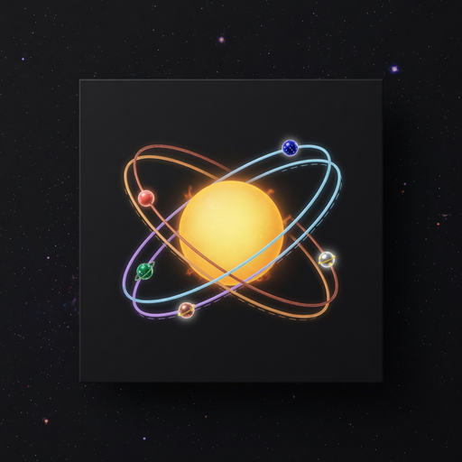

# JPL Horizons Navigator

<p align="center">
  
</p>


3D orbit visualization and DTN link timing for NASA/JPL's Horizons ephemeris system.

## Install (Ubuntu 24.04)
```bash
sudo apt install python3-tk
pip install matplotlib numpy --break-system-packages
python3 horizons_ui.py
```

## Features

- **3D Orbit Visualization** - Interactive plot with rotation/zoom
- **Animation** - Watch objects move along their orbits in real-time
- **Preset Bodies** - Planets, moons, barycenters
- **Custom Queries** - Asteroids, comets by designation
- **Reference Orbits** - Mercury/Venus/Earth/Mars shown for scale
- **DTN Link Timing** - Expected bundle travel time between any two nodes
  across your query window

## Usage

1. Select target (preset or custom like `Apophis;`)
2. Set Center to "Sun (heliocentric)"
3. Set Type to **VECTORS**
4. Click "Get Ephemeris & Plot"
5. Click **▶ Animate** to watch it move

The 3D view draws the Sun and the planetary reference rings only when the
plot origin really is the Sun or the solar-system barycenter. Geocentric,
planet-centred and observatory-centred queries are plotted on their own.

## DTN link timing

The **DTN Link Timing** tab answers the question a contact plan asks first:
how long is the propagation floor on this link, and how does it move?

Pick **Node A** and **Node B**, then click *Bundle Travel Time*. The query
reuses the Start / Stop / Step fields above. Horizons returns the range and
the one-way down-leg light time between the two nodes, and the tool charts
the light time across the window with the best and worst samples marked.

```
DTN link timing: Earth <-> Mars

Window             : 2026-Sep-26 00:00 to 2027-Sep-26 00:00  (74 samples)
One-way light time : 5.64 min best / 10.65 min mean / 17.09 min worst
Round-trip time    : 11.28 to 34.18 min
Range              : 0.678 to 2.055 AU

Shortest travel time : 2027-Feb-18 00:00 at 5.64 min (0.678 AU)
Longest travel time  : 2027-Sep-26 00:00 at 17.09 min (2.055 AU)
```

One-way light time is the propagation floor for a bundle on that link. It is
not the whole delivery time: store-and-forward hops, queuing, retransmission
and custody overhead all add to it. What this gives you is the physics term
that a contact plan, a timer margin or an RTT estimate has to start from.

The chart is a sanity check as much as a readout — the Earth-Mars curve
bottoms out at opposition and peaks near conjunction, which is what makes a
launch window worth waiting for.

## Tests

The suite runs offline — parsing, CENTER classification, COMMAND encoding,
validation and the Tk application are all exercised without touching the
network.

```bash
python3 -m unittest test_horizons_ui -v
```

The GUI tests need a display; headless machines can use Xvfb:

```bash
xvfb-run -a python3 -m unittest test_horizons_ui -v
```

One test talks to JPL and is opt-in:

```bash
HORIZONS_LIVE=1 python3 -m unittest test_horizons_ui -v
```

## API

https://ssd-api.jpl.nasa.gov/doc/horizons.html
